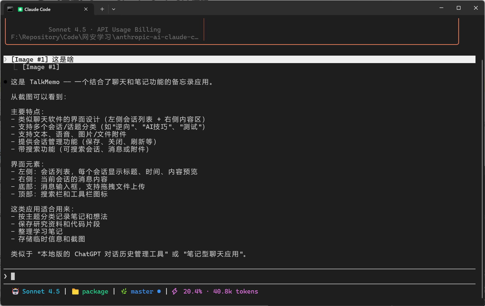

# open-claude-code

<p align="center">
  <strong>中文</strong> · <a href="./README_EN.md">English</a>
</p>
`open-claude-code` 是项目基于 `@anthropic-ai/claude-code@2.1.88` 版本相关 sourcemap 信息整理而来，在此基础上完成了编译修复、结构补全和可运行性调整。当前状态：已完成编译修复，可进行本地运行和代码阅读。

**当前仓库的恢复、修复与文档整理工作由 Codex 驱动完成。**

## 后续发展

本仓库的目标不是替代官方版本，而是为源码阅读、工程分析、构建流程研究和终端Agent实现参考提供一个相对完整的本地工程。

## 项目说明

这个仓库主要保留了 Claude Code 终端工具的核心工程结构，包括但不限于以下内容：

- `src/`：恢复后的主要源码
- `src/entrypoints/`：CLI 入口与相关初始化逻辑
- `vendor/`：平台相关二进制或运行时依赖
- `stubs/`：本地占位依赖
- `images/`：演示截图

### 私有 MCP/NAPI 兼容层进度等

下面这些是当前恢复版里和 Claude 私有 MCP、native / NAPI 替代实现相关的兼容层状态。这里区分的是 **import / build 已补齐** 和 **运行时能力是否真的恢复**：

| 组件 | 当前进度 | 可用情况 |
| --- | --- | --- |
| `@ant/claude-for-chrome-mcp` | 已补最小兼容层，可正常参与构建并暴露浏览器 MCP 工具定义。 | 可列出工具、读取类接口会返回空结果或 unavailable；**不能**真正连接浏览器扩展、配对会话或执行真实浏览器桥接操作。 |
| `@ant/computer-use-mcp` | 已补最小兼容层，主包和子路径导出都已补齐。 | 可提供 `request_access`、`list_granted_applications`、`current_display`、`switch_display`、`list_displays` 这类最小状态接口；鼠标、键盘、截图、剪贴板等真实 Computer Use 动作目前仍是占位 / unavailable。 |
| `@ant/computer-use-input` | 已补最小 stub。 | 当前只提供 `isSupported = false` 的降级语义，用来避免缺包报错；**不提供**真实输入注入能力。 |
| `@ant/computer-use-swift` | 已补最小 macOS 原生兼容层 shape。 | 权限、应用、显示器等查询接口会返回空值或默认值；截图、打开应用、捕获准备等原生能力仍未恢复。 |
| `image-processor-napi` | 已用 `sharp` 做开源替代，并补上 compat 导出。 | 常规图片读取、缩放、压缩链路基本可用；但 `getNativeModule()` 当前返回 `null`，依赖原生 fast path 的图片/剪贴板逻辑会自动降级到现有 fallback。 |
| `color-diff-napi` | 已不再依赖原生包，改为本地 TypeScript 实现。 | Structured diff 与语法高亮主链路可用；但实现基于 `highlight.js`，并非原始 native 栈 1:1 还原，像 `BAT_THEME` 这类细节仍是兼容实现。 |
| `audio-capture-napi` | 已补最小 stub，避免 voice 功能因缺包直接崩。 | Windows 仍需要真实 native 录音 backend，当前不可用；Linux / macOS 会继续尝试走项目里已有的 `arecord` / `rec` fallback 链路，但这不等于原始 native 录音能力已经恢复。 |

> 简单说：这些兼容层现在已经足够支撑源码恢复版继续构建、跑通主流程、做代码阅读和接口对照；其中 `image-processor-napi` 和 `color-diff-napi` 的恢复度相对更高，而 browser / computer-use / native audio 这几块仍主要停留在降级处理上。

## 环境要求

- Node.js 18或更高版本
- npm
- Bun

## 快速开始

安装依赖：

```bash
bun install 或 npm install
```

检查当前版本：

```bash
bun run version 或 npm run version
```

直接启动：

```bash
bun run dev 或 npm run dev
```

如需重新构建：

```bash
bun run build 或 npm run build
```

## 演示截图

### 启动界面


### 交互界面




## 免责声明

本仓库不是 Anthropic 官方项目，也不代表 Anthropic 的任何立场。

我方不拥有 Claude Code 的所有权，也不对 Claude Code 原始源码、名称、商标、相关品牌标识或其衍生权利主张任何所有权。与 Claude Code 相关的原始源码及其相关权利归 Anthropic 公司或其权利主体所有。

本仓库仅供学习、研究、交流和参考使用，请勿将其用于任何商业活动，包括但不限于：

- 商业分发
- 付费售卖
- 闭源集成
- 代部署服务
- 二次授权
- 任何可能侵犯原始权利人权益的用途

使用者应自行评估并承担由使用本仓库带来的风险与责任，包括但不限于合规风险、知识产权风险以及由此产生的直接或间接损失。

任何将本项目用于侵犯 Anthropic PBC 合法权益或规避产品政策的行为，均与本项目无关，风险自负。

如果你是相关权利人，并认为本仓库内容存在不适合公开展示或传播的部分，请通过仓库渠道联系处理。

## 许可说明

本仓库不对 Anthropic 原始代码授予任何额外许可证，也不意味着对上游项目进行了重新授权。除使用者依法享有的权利外，请不要将本仓库视为对 Claude Code 原始代码的开源授权替代品。

## 致谢

- 感谢 Anthropic提供Claude Code原始项目
- 感谢 Codex参与本仓库的恢复整理、编译修复与文档编写
- 感谢 [LinuxDo](https://linux.do/)论坛里可爱的佬友们提供的帮助
